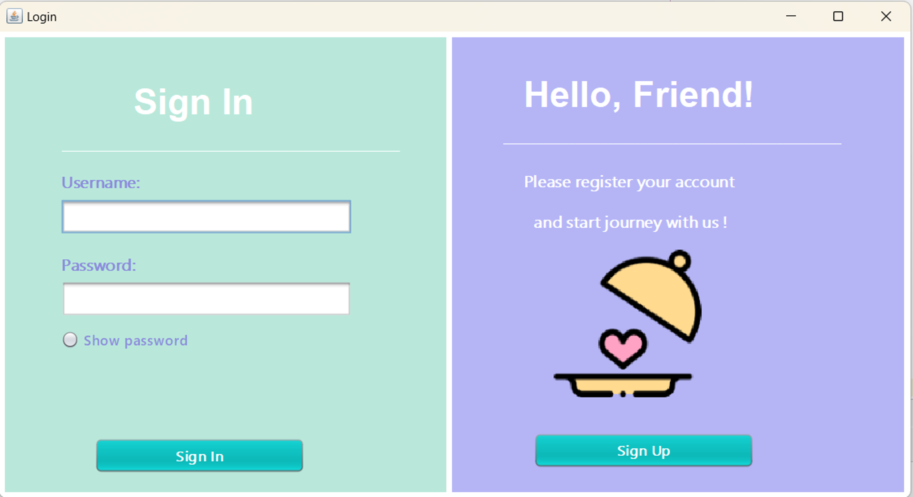
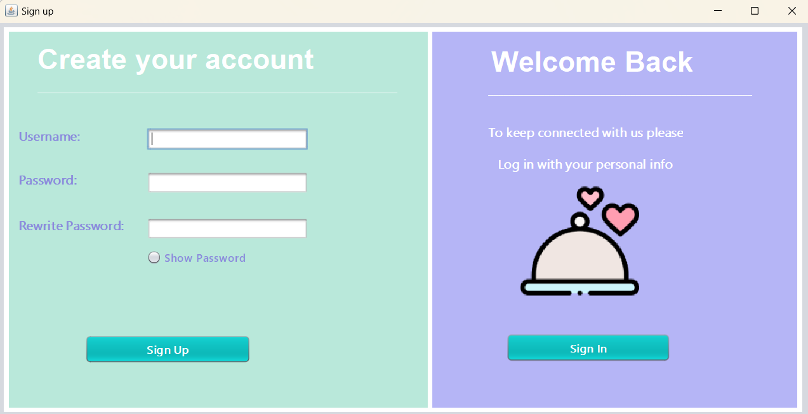
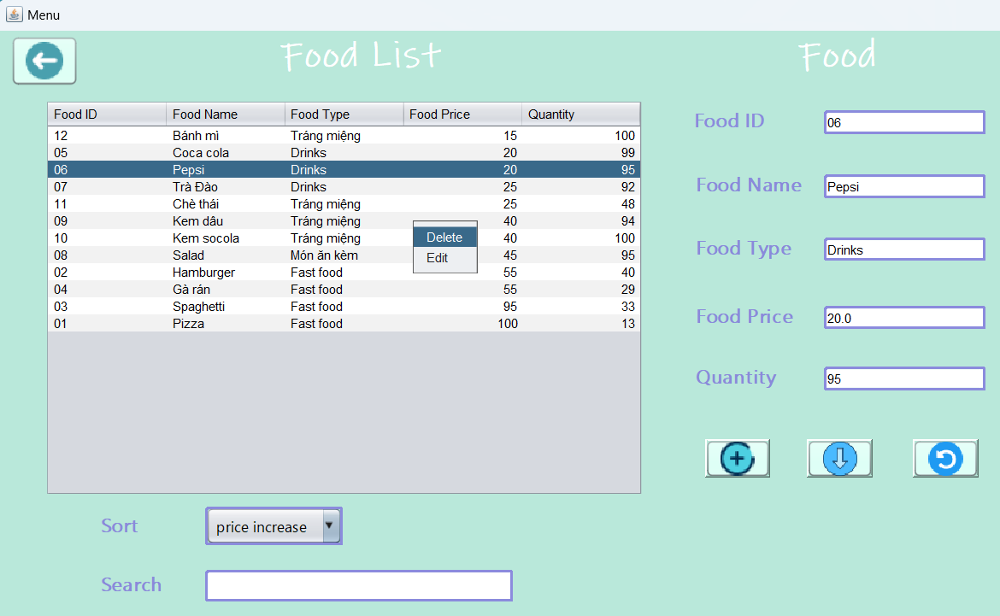
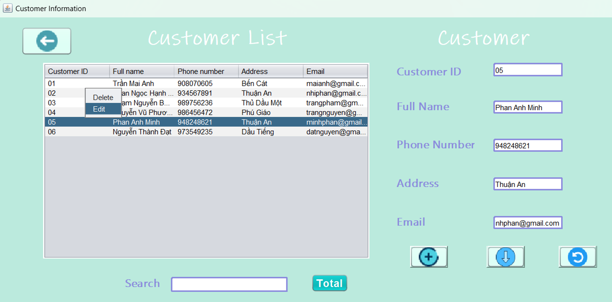
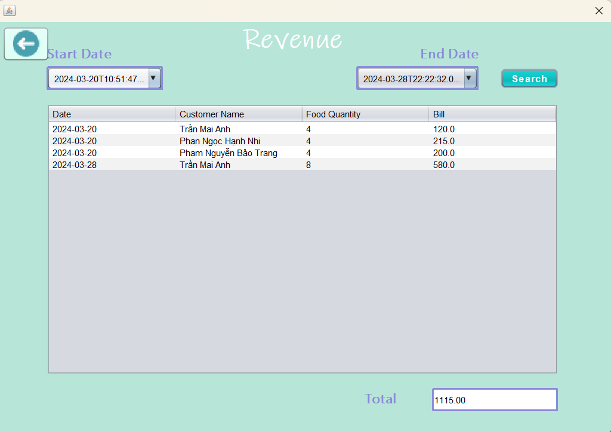

# 🍽️ Restaurant Management System 🍽️

## ✨ Overview

The **Restaurant Management System** is a software solution designed to streamline the daily operations of a restaurant. It offers features for managing food items, customers, billing, and revenue, helping restaurants operate efficiently and effectively.

---

## 🌟 Features

1. **🔑 Login and Account Registration**  
   - Secure sign-in and sign-up functionality for restaurant owners and staff.  
   
   

2. **🍔 Food Management**  
   - Manage food items, categories, and inventory.  
   

3. **👥 Customer Management**  
   - Add, delete, and search for customer information by ID or name.  
   

4. **🧾 Bill Management**  
   - Generate and manage food bills with getter and setter methods.  
   

5. **📊 Revenue Management**  
   - Track and analyze restaurant revenue for better decision-making.
   
---

## 🗂️ Project Structure

- **📁 lib**: Includes external libraries and dependencies.
- **📁 src/main/java**: Contains the source code for the project.
- **📁 target**: Compiled files and resources.
- **📄 Data Files**:
  - `📄 Bills.dat`
  - `📄 Customers.dat`
  - `📄 Foods.dat`
  - `📄 Owners.dat`
- **📄 SlideProject.pptx**: Presentation slides detailing the project.
- **📄 DemoProject.wmv**: Demo video showcasing the project.
- **📄 pom.xml**: Maven configuration file.

---
## 👩‍💻 Authors

- 🌟 Trần Mai Anh
- 🌟 Phan Ngọc Hạnh Nhi
  
---
## 📜 License
This project is licensed under the MIT License. See the LICENSE file for details.

---
## 📬 Contact
For any questions, feedback, or suggestions, feel free to reach out to us:

- 📧 Email: ph.hnhi0403@gmail.com
- 🌐 LinkedIn: Nhi Phan
- 📷 Instagram: hani.p__
  
We appreciate your interest in the Restaurant Management System! 💖

   
